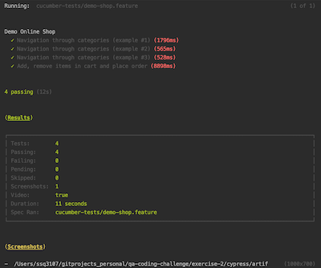

# qa-coding-challenge

### Tooling

- [Cypress](https://www.cypress.io/)

## Why use Cypress

Cypress is the best answer to what if we can use the same tool for UI testing to also test our APIs.
  
* Setup is minimal
* Cypress supports BDD and TDD style assertion
* We can add a visual test runner for our API tests and also run it headlessly on the command line

### Code

For REST API tests, check folder [exercise-1](./exercise-1).

For WEB FRONTEND tests, check folder [exercise-2](./exercise-2).

