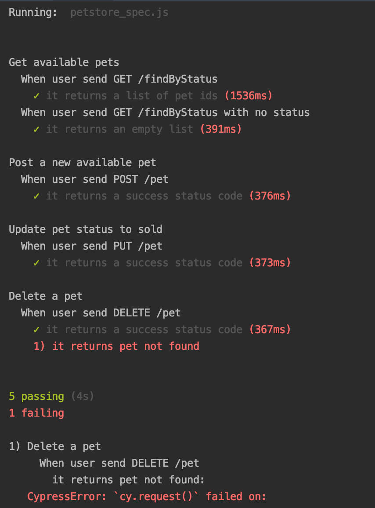

# ✍️ EXERCISE 1 – REST API AUTOMATION

## 🤖 Pre-requisites

To run the tests, please ensure you have the following installed:

[NPM](https://www.npmjs.com/get-npm)

[NodeJS](https://nodejs.org/en/download)


## ✅ How to run

* Clone the repo ```git clone git@github.com:sreesl/qa-coding-challenge.git```

* Go to the [project's directory](/exercise-1) and install the project dependencies, run ```npm install```

* To run the tests on your terminal, run ```npm test```

* To run the tests against the Cypress Test Runner (interactive mode), run ```npm cy:open```

* Test screenshots for failures will be available in the folder cypress/screenshots after test run.


## 🧯 Risks/ Issues faced

* The API automation checks required as per the challenge for request types POST, PUT and DELETE makes the tests dependent on each other since we are asserting for the same pet_id in all cases. 
This approach makes the checks brittle since failure of one case (POST) fails the rest (PUT, DELETE) which may be a false positive. We have to keep the tests independent of each other for better.

* When we create a new pet (POST request), pet id exceeds what Javascript considers a safe integer. Because of this, the number is stored to the maximum available precision and we are always returned with id= 9223127596080651000.
This complicates the further testing of updating and deleting newly created pet since we cant fetch the actual id. Swagger should have known this or dealt it by handling it as a string instead.

⚠️ Delete a pet test assertions are failing because of this.

Screenshot of a test run with valid input:




